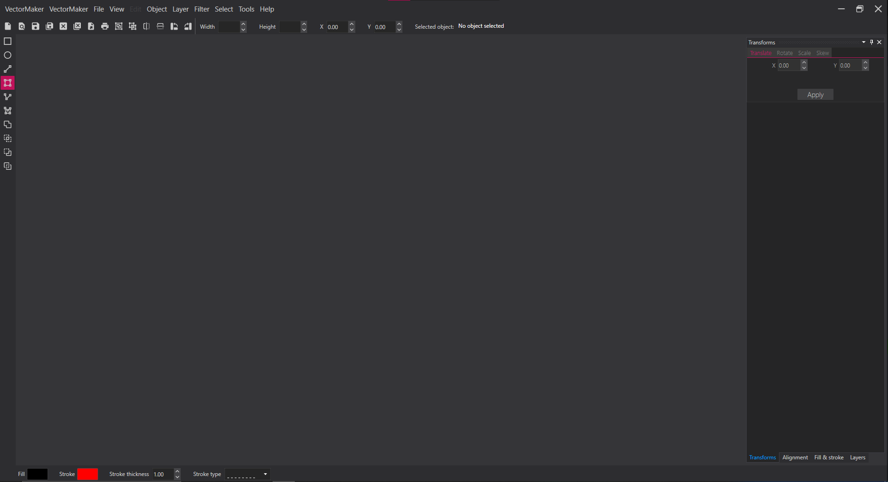
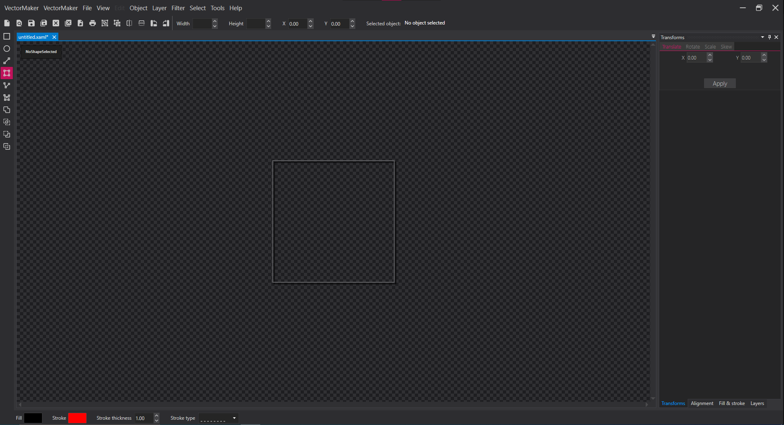
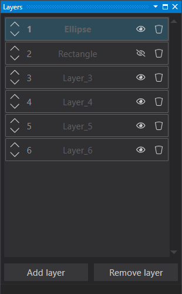
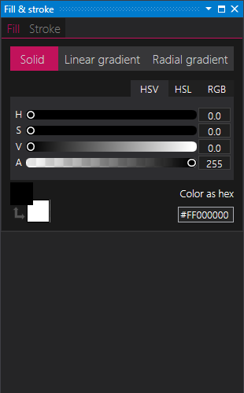
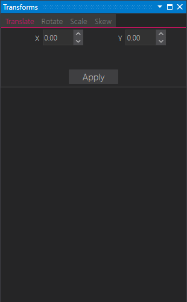
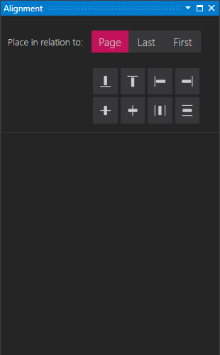
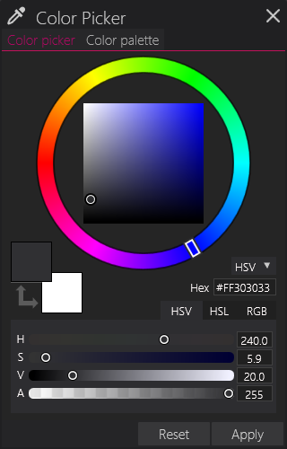
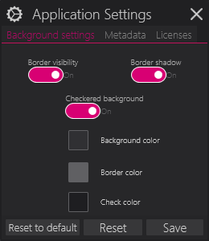
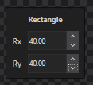

# VectorMaker
VectorMaker is SVG editor created for my Engineering Thesis.
This editor was made in Windows Presentation Foundation (C#,.NET).

## Table of contents
- [VectorMaker](#vectormaker)
  - [Table of contents](#table-of-contents)
  - [Authors](#authors)
  - [Specification](#specification)
  - [System requirements](#system-requirements)
  - [UserManual in PL](#usermanual-in-pl)
  - [User Interface](#user-interface)
___

## Authors
- [Emilia Starczyk](https://github.com/Emilysta),

## Specification
- .NET C# WPF
- XAML
- MVVM
- SVG app
- [Dirkster.AvalonDock](https://github.com/Dirkster99/AvalonDock)
- [MahApps.Metro oraz MahApps.Metro.IconPacks](https://mahapps.com/docs/)
- [PixiEditor.ColorPicker](https://github.com/PixiEditor/ColorPicker)
- [PDFSharp](http://www.pdfsharp.net/?AspxAutoDetectCookieSupport=1)
## System requirements
- Windows XP or Windows 7.0 and above,
- Minimum 1GB of RAM,
- Minimum 256MB of disk memory,
- .NET Framework installed, minimum version 3.0.

## UserManual in PL
You can find it [here](UserManual_VectorMaker.pdf)

## User Interface

<!--
## License
See a file [LICENSE.md](LICENSE.md).
-->